Problem 1: Flights at ABIA
--------------------------

When planning travel from Austin, especially with connecting flights,
consider cancellations and delays. This analysis shows the months and
destinations which are the worst.

The graph below plots month and cancellation rate (out of all flights)
for the top ten most frequented destinations out of the Austin-Bergstrom
International Airport.

One particularly surprising finding is that the largest proportion of
cancelled flights occur in March and April, whereas October and November
have very low cancellation rates.

Additionally, in most months, Dallas’s major airports (DFW and DAL)
experience a large fraction of cancellations, but in September,
Houston’s two major airports (HOU and IAH) do.

To investigate this surprising pattern of cancellations, it is worth
looking into delays for each month.

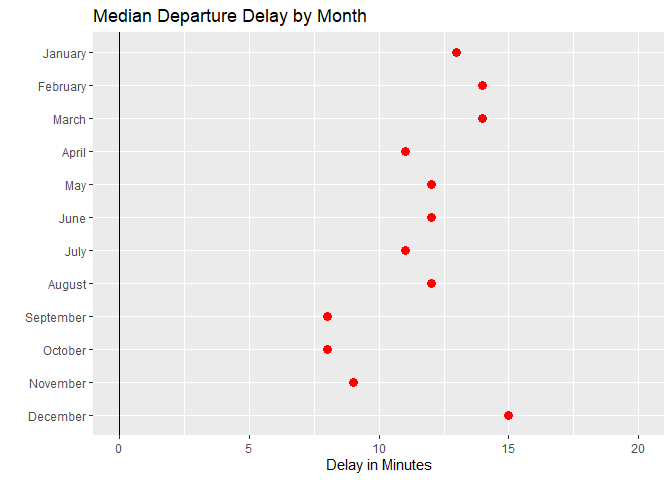

Departure delays are also very low in October, but in contrast to the
high number of cancellations in September, there are relatively few
delays. December is worst for departure delays, alongside February and
March.

So, February and March are consistently bad for both cancellations and
departure delays. December exhibits low cancellation rates but the
highest departure delay times.

That begs the question of whether arrival delays exhibit similar
patterns.

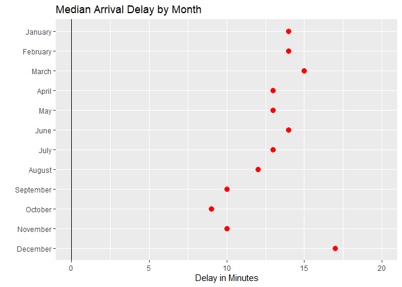

September through November experience relatively few arrival delays, and
February and March still experience the greatest arrival delay time;
however, the summer months experience more arrival delays than departure
delays.

December consistently has the greatest delay time, for both arrivals and
departures.

In sum, anticipate a greater chance of cancellations and delays in
February and March, and delays in December. Since the highest
cancellation rates for top destinations from the Austin-Bergstrom
International Airport are within the state, it is worth considering more
reliable transportation options to guarantee reaching your destination.

Problem 2: Regression Practice (Creatinine)
-------------------------------------------

#### Question 1

What creatinine clearance rate should we expect, on average, for a 55
year old?

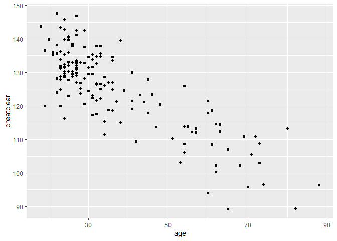

    ## (Intercept)         age 
    ## 147.8129158  -0.6198159

    ##       1 
    ## 113.723

The predicted creatinine clearance rate for a 55-year old is 113.723
mL/minute.

#### Question 2

How does creatinine clearance rate change with age?

The coefficient for the fitted linear model shows that creatinine
clearance rate changes at a rate of -0.6198159 milliliters/minute per
year.

#### Question 3

Whose creatinine clearance rate is healthier (higher) for their age: a
40-year-old with a rate of 135, or a 60-year-old with a rate of 112?

    ##        1 
    ## 123.0203

    ##       1 
    ## 110.624

The person with the higher age-adjusted creatinine rate is 40 years old,
since 123.0203 &gt; 110.624.

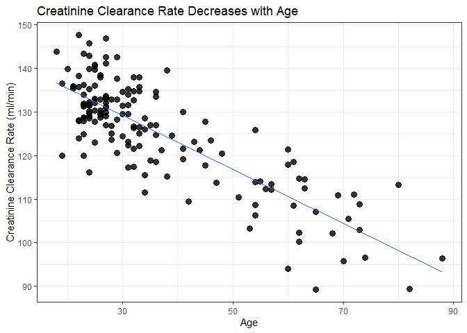

Problem 3: Green Buildings
--------------------------

Our investigation into the decision of whether or not to obtain a green
certification contradicts the original report’s findings. In particular,
focusing more on the desired specifications of area, age, and class A
distinction points to the fact that “green” buildings are not, in
itself, a factor that results in higher rent. Further research needs to
be done on building clusters to extract more precise estimates of other
construction considerations.

To start, we filtered out the buildings with less than 10% occupancy.

Below is the table without any filter for size, resulting in the same
figures as the previous report.
<table class="table" style="width: auto !important; ">
<caption>
Median Rent Overall
</caption>
<thead>
<tr>
<th style="text-align:right;">
Green Rating
</th>
<th style="text-align:right;">
Median Rent
</th>
</tr>
</thead>
<tbody>
<tr>
<td style="text-align:right;">
0
</td>
<td style="text-align:right;">
25.03
</td>
</tr>
<tr>
<td style="text-align:right;">
1
</td>
<td style="text-align:right;">
27.60
</td>
</tr>
</tbody>
</table>
Since the building we plan to construct is 250,000 square feet, it would
be appropriate to limit our focus to buildings within the relevant range
of square footage. Below is the table with only buildings with square
footage between 200,000 and 300,000. The difference in median rent for
green and non-green is only $0.84 per square foot, instead of the
previous consultation of $2.60 per square foot.
<table class="table" style="width: auto !important; ">
<caption>
Median Rent by Relevant Area
</caption>
<thead>
<tr>
<th style="text-align:right;">
Green Rating
</th>
<th style="text-align:right;">
Median Rent
</th>
</tr>
</thead>
<tbody>
<tr>
<td style="text-align:right;">
0
</td>
<td style="text-align:right;">
27.95
</td>
</tr>
<tr>
<td style="text-align:right;">
1
</td>
<td style="text-align:right;">
28.91
</td>
</tr>
</tbody>
</table>

Therefore, the actual difference in median rent shows that the revenue
generated by the green building is not as strong as the previous report
suggests. Instead of 250,000 square feet multiplied by $2.60 extra in
revenue for the green building ($650,000 per year), the difference in
median rent for the relevant square footage more closely represents
250,000 \* $0.84, which is an additional $210,000 per year, assuming the
difference in rent is solely attributed to green buildings. This means
that the payback period for a green building is much longer than the
predicted 7.7 years from the previous report. There are other potential
confounding factors that could also influence this $0.84 difference in
rent, especially if green buildings are inherently correlated with
certain attributes.

Filtering further for age, since our building will be newly constructed,
it is more relevant to focus on buildings that are less than 10 years
old.
<table class="table" style="width: auto !important; ">
<caption>
Median Rent by Relevant Area and Age
</caption>
<thead>
<tr>
<th style="text-align:right;">
Green Rating
</th>
<th style="text-align:right;">
Median Rent
</th>
</tr>
</thead>
<tbody>
<tr>
<td style="text-align:right;">
0
</td>
<td style="text-align:right;">
35.16
</td>
</tr>
<tr>
<td style="text-align:right;">
1
</td>
<td style="text-align:right;">
28.50
</td>
</tr>
</tbody>
</table>

The median rent for non-green buildings is actually much higher than
that for green buildings if filtering for both square footage and age.
Non-green buildings are shown to have a $7.26 advantage over green
buildings, not accounting for other confounding factors.

The previous report’s findings correctly filtered out outliers in terms
of low occupancy but did not consider the relevant range for the desired
building. The focus on newer buildings around 250,000 square feet allows
for a more targeted comparison and reveals that simply comparing green
and non-green buildings as a whole introduces a host of problems due to
the vast range of possible building types.

Age Distribution for Non-Green and Green Buildings
--------------------------------------------------

Green buildings are newer on average than non-green buildings. They are
both positively skewed; however, the non-green distribution looks almost
bimodal. The median is not necessarily be the best indicator, since the
age is concentrated in two separate areas.

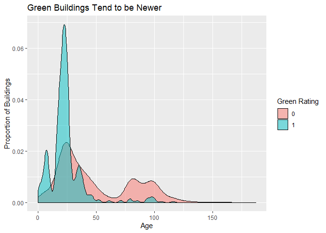

Class A and Green Rating
------------------------

Green buildings are more likely to be of Class A rating, which earn a
higher median rent. This could be a problem, since it does not
accurately represent the supposed advantage of green buildings on their
own. It may be possible to earn a high rent without getting a green
rating.
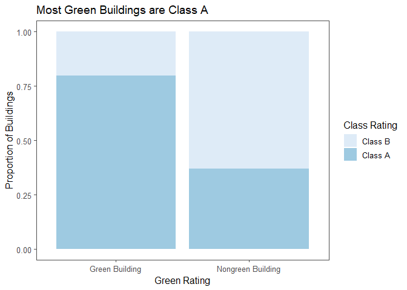
<table class="table" style="width: auto !important; ">
<caption>
Median Rent by Relevant Area and Age for Class A
</caption>
<thead>
<tr>
<th style="text-align:right;">
Class A Rating
</th>
<th style="text-align:right;">
Median Rent
</th>
</tr>
</thead>
<tbody>
<tr>
<td style="text-align:right;">
0
</td>
<td style="text-align:right;">
28
</td>
</tr>
<tr>
<td style="text-align:right;">
1
</td>
<td style="text-align:right;">
35
</td>
</tr>
</tbody>
</table>

Total Revenue of Non-Green and Green Buildings by Leasing Rate
--------------------------------------------------------------

We calculated leasing rate, or occupancy rate, divided by 100, to obtain
a decimal value; then, we multiplied by rent (per square foot) to get
total revenues per square foot the company can gain. We explored the
relationship between leasing rate and total revenues. From a revenue
perspective, the green building does not have a distinct advantage over
non-green buildings. In addition, in our sample, the non-green buildings
have a larger market than green buildings when the leasing rate is less
than 50%. Furthermore, we know the cost of constructing a green building
is higher than that of non-green buildings.

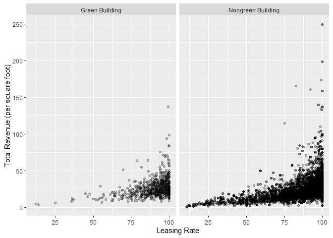

The graph below gives a clearer quantitative comparison of the total
revenue by different leasing(occupancy) rates.

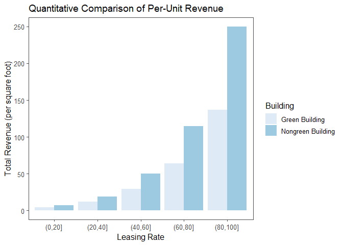

Issues with Clusters
--------------------

The rent for each cluster has a wide range, and may possibly represent
regional differences in rent. In addition, there is no information in
the data set for the location of the clusters. As such, we are not able
to pinpoint exactly what rent we could expect to charge since it varies
so much across clusters. Further, the distribution is positively skewed;
we don’t know which side of the distribution the rent we charge would be
on. It would be useful to gather location information on the clusters so
that the analysis could compare buildings local to our planned
construction site.

<table class="table" style="margin-left: auto; margin-right: auto;">
<thead>
<tr>
<th style="text-align:left;">
</th>
<th style="text-align:right;">
min
</th>
<th style="text-align:right;">
Q1
</th>
<th style="text-align:right;">
median
</th>
<th style="text-align:right;">
Q3
</th>
<th style="text-align:right;">
max
</th>
<th style="text-align:right;">
mean
</th>
<th style="text-align:right;">
sd
</th>
<th style="text-align:right;">
n
</th>
<th style="text-align:right;">
missing
</th>
</tr>
</thead>
<tbody>
<tr>
<td style="text-align:left;">
</td>
<td style="text-align:right;">
9
</td>
<td style="text-align:right;">
19.7675
</td>
<td style="text-align:right;">
25.2
</td>
<td style="text-align:right;">
32.01
</td>
<td style="text-align:right;">
71.44
</td>
<td style="text-align:right;">
26.81789
</td>
<td style="text-align:right;">
9.713931
</td>
<td style="text-align:right;">
691
</td>
<td style="text-align:right;">
0
</td>
</tr>
</tbody>
</table>

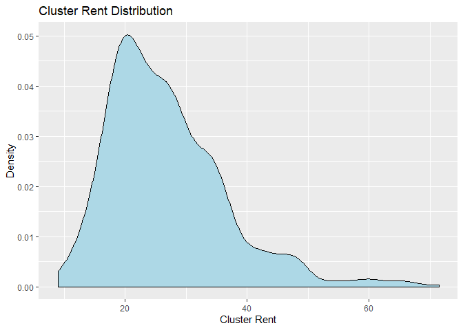

Issues with Utility Costs
-------------------------

Although gas costs are mostly concentrated around the same level,
electricity costs have wild variation. Again, without knowing the
specific location, we cannot know how the electricity and gas costs will
factor into the rent.

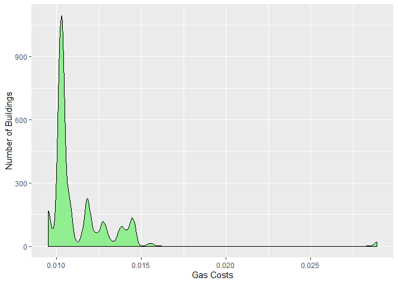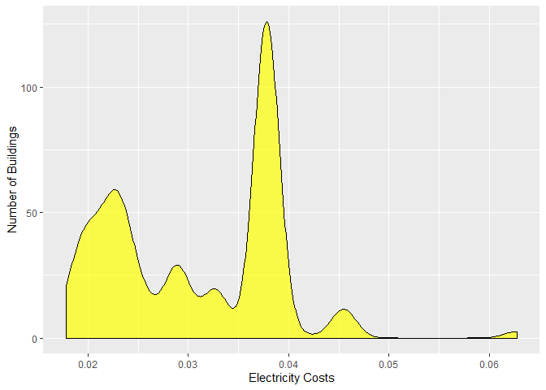

The initial estimate given did not account for many of the variables
that could account for rent for green buildings. In order to make a more
fair comparison and a thorough analysis, more information, especially
about clusters, is needed. But for starters, the comparison should be
made for buildings of the similar size and age. The age distribution is
skewed for both green and non-green buildings, so a simple average will
not suffice. We showed that the Class A rating may be a confounding
variable since most green buildings are Class A. Thus, it may be more
worthwhile to pursue a Class A rating instead since buildings with this
rating have a higher median rent than Class B buildings. Because rents
are highly varied across clusters, and no information is given about the
location of these cluster, we do not know how competitive the rent we
charge would be, or if it is reasonable for our region. Electricity
costs also have a wide range, and it would factor into the rent.

Problem 4: Milk Prices
----------------------

First, graph the data.

    ggplot(data = milk) +
      geom_point(aes(x = price, y = sales)) +
      geom_smooth(mapping = aes(x = price, y = sales))

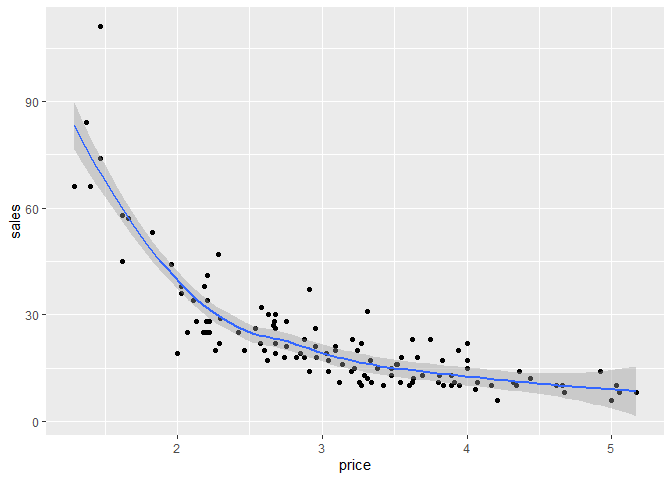

Notice that this is not a linear relationship, which makes sense since
quantity demanded is modeled in microeconomics using a Power Law:
*Q* = *K**P**E*, where Q is the quantity demanded, P is the
price, E is the price elasticisty of demand and K is a constant.

Step 1: Write an equation that expresses net profit N in terms of both Q
and P (and cost c)

*N* = (*P* − *c*)*Q*

Step 2: Use the microeconomic model of quanity demanded, which is a
function of the price.

*Q* = *f*(*P*) = *K**P**E*, so that
*N* = (*P* − *c*)*f*(*P*) = (*P* − *c*)(*K**P**E*)

The values of K and E are uknown, so we must estimate them from the
data.

We can do this using linear regression using the product and power rules
of logarithms, which tell us that
*l**n*(*Q*) = *l**n*(*K**P**E*) = *l**n*(*K*) + *E*(*l**n*(*P*)).

This has the form of a simple linear regression, where
*β*0 = *l**n*(*K*) and *β*1 = *E*.

Step 3: Use simple linear regression to estimate the unknown
coefficients.

    model <- lm(log(sales) ~ log(price), data = milk)

Confirm the linearity of the logarithm of the data by plotting.

    plot(log(sales) ~ log(price), data = milk)
    abline(model, col = "red")

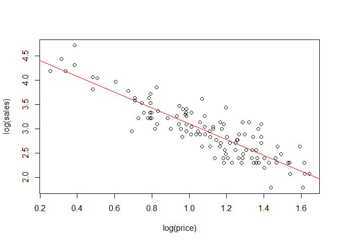

Now we have an estimate of ln(K) in the form of the intercept of the
model, 4.72, and of E in the form of the slope of the model, -1.62

Taking the exponential of both sides gives us net profit in terms of P
and c alone, *N* ≈ (*P* − *c*)(112*P* − 1.62)

Let’s assume c = 1.

    x <- milk$price
    c <- 1
    curve((x - c) * K * x^(E), from = 1, to = 9, xlab = "Price", ylab = "Sales")

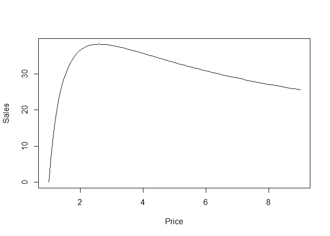

    #Zoom in 
    curve((x - c) * K * x^(E), from = 2.5, to = 2.7, xlab = "Price", ylab = "Sales")

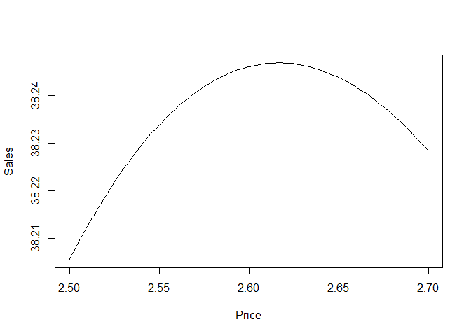

    #Zoom in more
    curve((x - c) * K * x^(E), from = 2.60, to = 2.63, xlab = "Price", ylab = "Sales")

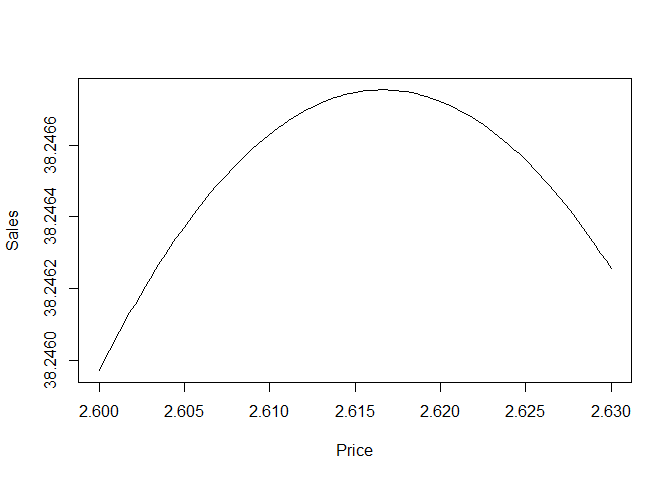

From the final plot, we see that the price that maximizes net profit is
close to $2.62.
