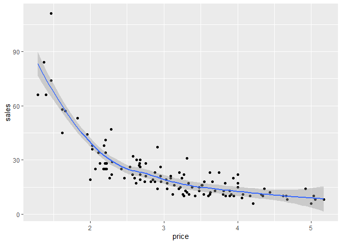
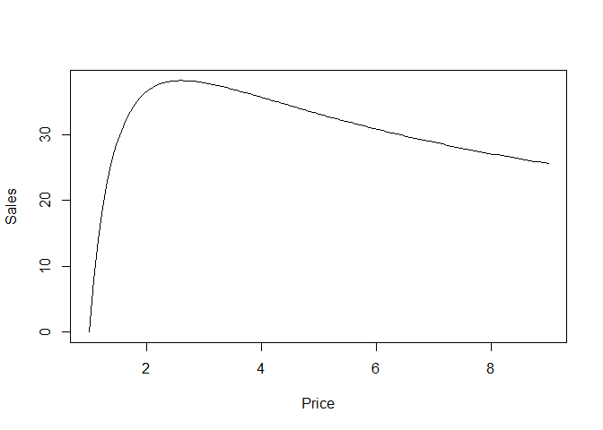
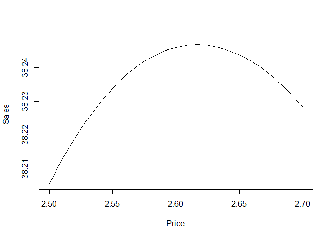
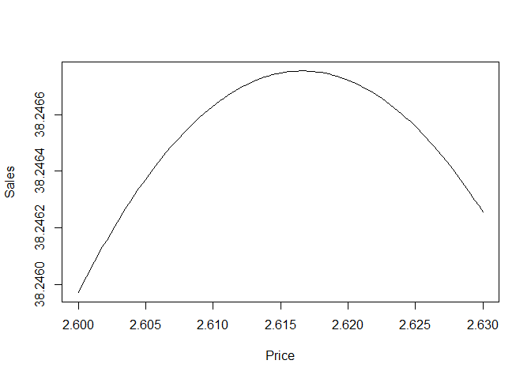

SDS 323 Exercises 1
-------------------

### Kyle Carter, Jacob Rachiele, Crystal Tse, Jinfang Yan

### 2/14/2020

    # load required packages
    library(mosaic)
    library(tidyverse)

Problem 1: Flights at ABIA
--------------------------

Problem 2: Regression Practice (Creatinine)
-------------------------------------------

Problem 3: Green Buildings
--------------------------

Problem 4: Milk Prices
----------------------

    # Read the data file
    milk <- read.csv("data/milk.csv")

First, graph the data.

    ggplot(data = milk) +
      geom_point(aes(x = price, y = sales)) +
      geom_smooth(mapping = aes(x = price, y = sales))

Notice that this is not a linear relationship, which makes sense since
quantity demanded is modeled in microeconomics using a Power Law:
*Q* = *K**P**E*, where Q is the quantity demanded, P is the
price, E is the price elasticisty of demand and K is a constant.

Step 1: Write an equation that expresses net profit N in terms of both Q
and P (and cost c)

*N* = (*P* − *c*)*Q*

Step 2: Use the microeconomic model of quanity demanded, which is a
function of the price.

*Q* = *f*(*P*) = *K**P**E*, so that
*N* = (*P* − *c*)*f*(*P*) = (*P* − *c*)(*K**P**E*)

The values of K and E are uknown, so we must estimate them from the
data.

We can do this using linear regression using the product and power rules
of logarithms, which tell us that
*l**n*(*Q*) = *l**n*(*K**P**E*) = *l**n*(*K*) + *E*(*l**n*(*P*)).

This has the form of a simple linear regression, where
*β*0 = *l**n*(*K*) and *β*1 = *E*.

Step 3: Use simple linear regression to estimate the unknown
coefficients.

    model <- lm(log(sales) ~ log(price), data = milk)

Confirm the linearity of the logarithm the data by plotting.

    plot(log(sales) ~ log(price), data = milk)
    abline(model, col = "red")

Now we have an estimate of ln(K) in the form of the intercept of the
model, 4.72, and of E in the form of the slope of the model, -1.62

Taking the exponential of both sides gives us net profit in terms of P
and c alone, *N* ≈ (*P* − *c*)(112*P* − 1.62)

Let’s assume c = 1.

    x <- milk$price
    c <- 1
    curve((x - c) * K * x^(E), from = 1, to = 9, xlab = "Price", ylab = "Sales")

    #Zoom in 
    curve((x - c) * K * x^(E), from = 2.5, to = 2.7, xlab = "Price", ylab = "Sales")

    #Zoom in more
    curve((x - c) * K * x^(E), from = 2.60, to = 2.63, xlab = "Price", ylab = "Sales")

From the final plot, we see that the price that maximizes net profit is
close to $2.62.
