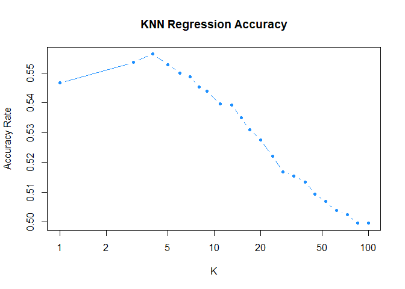
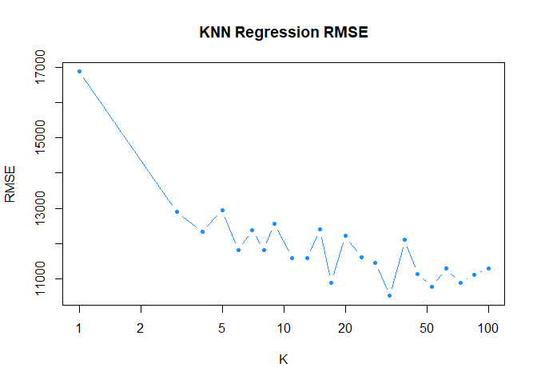
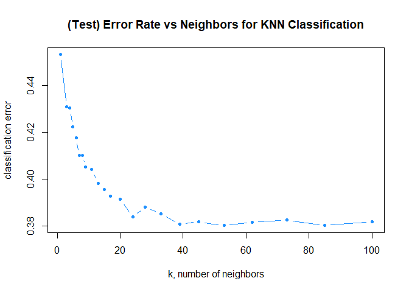

Problem 3
=========

Becoming “Viral”
----------------

Mashable currently has about 49% of its articles go “viral,” or get
shared more than 1,400 times. Is there any way to improve this, or is it
completely random?

There are several factors that can be considered. These include, but are
not limited to, the subject matter (e.g., “Entertainment”, “World”,
“Tech”), day of publication, and polarity of the words in the article’s
content and title.

KNN Regression Approach
-----------------------

We fit a linear regression model to predict the number of times an
article was shared using several variables, including the number of
words in the title, number of links (in general and to other Mashable
articles), subject matter, and average negative polarity of the article.
These variables were selected based upon their statistical significance
in a regression with all of the variables in the dataset used to predict
number of shares.

A comprehensive overview of the variables used in our regression model
is summarized in the table below.

**Table 1**

<table>
<thead>
<tr class="header">
<th>Variable Name</th>
<th>Description</th>
</tr>
</thead>
<tbody>
<tr class="odd">
<td>n_tokens_title</td>
<td>Number of words in the title</td>
</tr>
<tr class="even">
<td>num_hrefs</td>
<td>Number of links</td>
</tr>
<tr class="odd">
<td>num_self_hrefs</td>
<td>Number of links to other articles published by Mashable</td>
</tr>
<tr class="even">
<td>num_imgs</td>
<td>Number of images</td>
</tr>
<tr class="odd">
<td>average_token_length</td>
<td>Average length of the words in the content</td>
</tr>
<tr class="even">
<td>num_keywords</td>
<td>Number of keywords in the metadata</td>
</tr>
<tr class="odd">
<td>data_channel_is_lifestyle</td>
<td>Is data channel ‘Lifestyle’?</td>
</tr>
<tr class="even">
<td>data_channel_is_entertainment</td>
<td>Is data channel ‘Entertainment’?</td>
</tr>
<tr class="odd">
<td>data_channel_is_bus</td>
<td>Is data channel ‘Business’?</td>
</tr>
<tr class="even">
<td>data_channel_is_socmed</td>
<td>Is data channel ‘Social Media’?</td>
</tr>
<tr class="odd">
<td>data_channel_is_tech</td>
<td>Is data channel ‘Tech’?</td>
</tr>
<tr class="even">
<td>data_channel_is_world</td>
<td>Is data channel ‘World’?</td>
</tr>
<tr class="odd">
<td>self_reference_min_shares</td>
<td>Min. shares of referenced articles in Mashable</td>
</tr>
<tr class="even">
<td>avg_negative_polarity</td>
<td>Avg. polarity of negative words</td>
</tr>
</tbody>
</table>

These variables that help in explaining the number of times an article
was shared also have an intuitive reasoning behind their inclusion in
the model. For example, the number of words in the title might
contribute to how “click-worthy” a certain article is, increasing the
likelihood that is shared more frequently. Links to an article allow for
easy access to its contents, and more keywords in the metadata make an
article more likely to found by individuals that then share it.

Below are the different values of K tested to find the optimal K for the
out-of-sample accuracy.

    ##  [1]   1   3   4   5   6   7   8   9  11  13  15  17  20  24  28  33  39  45  53
    ## [20]  62  73  85 100

Iterating across the above range of K to find the lowest RMSE (Root Mean
Square Error), we try to find the best K.

    ## [1] 33

    ## [1] 10524.59

We find that the lowest RMSE is when K = 33. However, the K value with
the highest out-of-sample accuracy has yet to be calculated.

    ## [1] 4

    ##       K4 
    ## 12350.07

Above is the best K value for out-of-sample accuracy. Although it seems
like a low K value is not optimal for minimizing RMSE since it would
lead to overfitting of the data, K = 4 has a RMSE of 1.23500710^{4}, as
opposed to K = 33 with a RMSE of 1.052458710^{4}.

Below is a plot of the K against the out-of-sample accuracy rate. While
the RMSE is lower for K = 33, creating a model that is applicable to new
data and accurate is also a high priority.

The confusion matrix for K = 4 is shown below.
<table class="table" style="margin-left: auto; margin-right: auto;">
<thead>
<tr>
<th style="text-align:left;">
</th>
<th style="text-align:right;">
Not Viral
</th>
<th style="text-align:right;">
Viral
</th>
</tr>
</thead>
<tbody>
<tr>
<td style="text-align:left;">
Not Viral
</td>
<td style="text-align:right;">
1295
</td>
<td style="text-align:right;">
867
</td>
</tr>
<tr>
<td style="text-align:left;">
Viral
</td>
<td style="text-align:right;">
2648
</td>
<td style="text-align:right;">
3119
</td>
</tr>
</tbody>
</table>

The out-of-sample accuracy is shown below.

    ## [1] 0.5566906

The overall error rate is shown below.

    ## [1] 0.4433094

The true positive rate (percentage of Viral that are correctly
identified) is shown below.

    ## [1] 0.7824887

The true negative rate (percentage of Nonviral that are correctly
identified) is shown below.

    ## [1] 0.3284301

The false positive rate (percentage of Viral incorrectly identified as
Nonviral) is shown below.

    ## [1] 0.6715699

The false negative rate (percentage of NonViral incorrectly identified
as Viral) is shown below.

    ## [1] 0.2175113

It is best to have both a low RMSE and high accuracy rate.

K = 33 has an average accuracy rate of about 0.4934416, error rate of
0.5065584, true positive rate of 0.9907716, and false positive rate of
0.9764151.

Meanwhile, K = 4 has accuracy rate of 0.5566906, error rate of
0.4433094, true positive rate of 0.7824887, and false positive rate of
0.6715699.

Thus, K = satisfies the criteria better than K = 33, so we find the
optimal K based on a higher accuracy rate out-of-sample.

In contrast, the null model, which always predicts that an article will
not be viral, has a true positive rate of 0.4934416. The above KNN
regression model has a slightly higher out-of-sample accuracy rate of
about 0.552; however, it is inherently difficult to predict whether an
article will go viral, so this number is still relatively low.

    ## (Intercept) 
    ##   0.4934416

KNN Classification Approach
---------------------------

Approaching the problem considering the dependent variable as a binary
variable, rather than a numerical variable, yields different results. We
defined a dummy variable “Viral” that equals 1 when the number of shares
is greater than 1400.

    ## [1] 53

    ## [1] 0.3801236

The following chart shows the relationship between the value of K and
classification error. This chart helps us to find the optimal K with the
lowest classification error.

    ## [1] 0.3807542

    ## error 
    ##     1

There is an average of 49% of Viral and 51% Nonviral in the test set.

    ## [1] 0.4933787

    ## [1] 0.5066213

Below, the confusion matrix for the KNN classification method is
displayed.

    ##            Actual
    ## knn.pred    Not Viral Viral
    ##   Not Viral      2546  1548
    ##   Viral          1471  2364

The out-of-sample accuracy is shown below.

    ## [1] 0.6192458

The overall error rate is shown below.

    ## [1] 0.3807542

The true positive rate (percentage of Viral that are correctly
identified) is shown below.

    ## [1] 0.6042945

The true negative rate (percentage of Nonviral that are correctly
identified) is shown below.

    ## [1] 0.6338063

The false positive rate (percentage of Viral incorrectly identified as
Nonviral) is shown below.

    ## [1] 0.3661937

The false negative rate (percentage of NonViral incorrectly identified
as Viral) is shown below.

    ## [1] 0.3957055

Comparing Approach Performance
------------------------------

Averaged across 30 train-test splits, the KNN regression approach
(regress first and threshold second) had an out-of-sample accuracy rate
of around 0.546, whereas the KNN classification approach (threshold
first and regress/classify second) had about 0.617 accuracy
out-of-sample.

The KNN regression method has a smaller optimal K value where the error
is lowest (K = 4), as opposed to the KNN classification method which has
an optimal K that is much higher.

As for why the classification technique outperforms the model where we
regress then threshold, we must look at the difference between
regression and classification. The regression model predicts a numerical
value, shares, based on several predictors. This predicted value can be
greater than the bounds of probability between 0 and 1. In the case
where the threshold clearly delineates between viral and not viral, then
the regress first, threshold second method would be fine. However, when
there are outliers, such as a few articles that get several hundred
thousand shares as in this dataset, then the regression model’s
predictions would be affected. The linear regression slope itself would
lean towards the outliers, while the threshold stays at 1,400 shares. As
a result, articles that were previously classified as viral are now
predicted to not be viral. The classification method has higher accuracy
because the nearest neighbors are either 1 or 0. The difference in
magnitude is not accounted for, so any articles with many shares do not
affect the estimate of viral or not viral.
