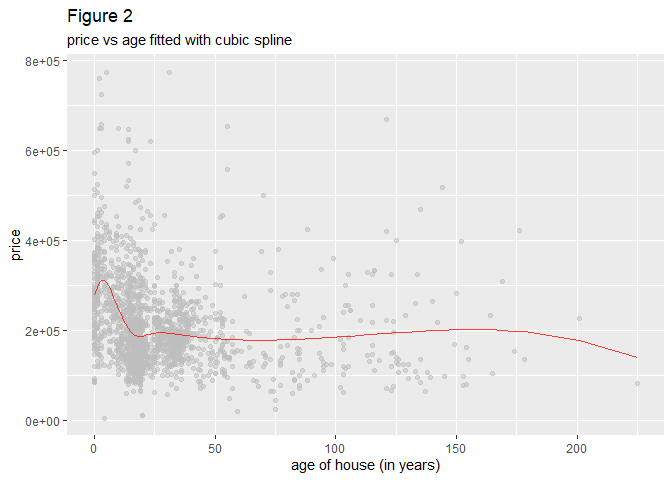

Saratoga House Prices
---------------------

### Question

#### What is the best price-modeling strategy for predicting property market value?

### Data

The data set used to answer this question includes the prices of 1,728
houses in Saratoga County, New York in the year 2006. In addition to
price, the data set includes 15 other attributes for each house — 9
quantitative, e.g., house age, living area, and number of bedrooms, and
6 categorical, e.g., whether the house has central air conditioning, is
a new construction, the type of heating system, and the type of fuel
used for that heating system.

### Methods

Two methods are used to analyze the data and form predicted house
prices. The first was linear regression, which assumes that house price
is a linear function of the predictive attributes, and the second is
K-nearest-neighbors regression, which makes no assumptions about the
form of the function used to predict prices.

Instead, it predicts the price of a house based on the prices of other
houses that are most similar to the one being considered, where
similarity is measured by how close the values of the predictor
attributes are to the house being considered. For example, if square
footage was the only predictor attribute and the house whose price we
want to predict was 3,000 square feet, then we would find the average
price of the K houses that are closest to being 3,000 square feet and
use that as our prediction.

80% of the houses were selected at random to train each model. The
remaining 20% of the houses were used to test the predictive performance
of each model, measured by the root mean squared error (RMSE) obtained
my comparing each model’s predicted prices with the actual prices
contained in the test set.

#### Attribute Selection

The attributes used as predictors of housing prices were determined by
examining the correlation structure of the data, by visual examination
of the relationships among the predictors and prices, and ultimately by
the ability of each potential predictor to reduce the RMSE of the
predictions.

The attributes that were used to predict housing prices are given in
Table 1

**Table 1**

<table>
<thead>
<tr class="header">
<th>Attribute</th>
<th>Description</th>
</tr>
</thead>
<tbody>
<tr class="odd">
<td>living area</td>
<td>living area in square feet</td>
</tr>
<tr class="even">
<td>bedrooms</td>
<td>The number of bedrooms in the house</td>
</tr>
<tr class="odd">
<td>bathrooms</td>
<td>The number of bathrooms in the house</td>
</tr>
<tr class="even">
<td>central air</td>
<td>whether the house includes central air conditioning</td>
</tr>
<tr class="odd">
<td>age</td>
<td>The age of the house in years</td>
</tr>
<tr class="even">
<td>percent college</td>
<td>The percent of the neighborhood that graduated college</td>
</tr>
<tr class="odd">
<td>waterfront</td>
<td>Whether the house is a waterfront property</td>
</tr>
<tr class="even">
<td>new construction</td>
<td>Whether the house was newly constructed</td>
</tr>
</tbody>
</table>

### Results

The best performing K-nearest-neighbors model was at K = 15 which had a
prediction RMSE of 64456.

On the other hand, the linear regression model achieved a far superior
prediction RMSE of 59764.

Figure 1 displays prediction RMSE against increasing values of K. The
RMSE for K-nearest-neighbors is displayed in red. The RMSE of the linear
regression model is the blue horizontal line.

The greater predictive accuracy of the linear regresson model is the
result of using the right set of predictor attributes, modeling the
interactions among those predictors, and adding flexibility to the model
through the use of the cubic spline, which divides the range of the
predictor variable into distinct intervals and fits a cubic polynomial
curve to each interval separately.

In particular, using age and percent of college graduates as simple
predictors doesn’t give the linear model much improvement in predictive
power. However, using the cubic spline mentioned above results in a
dramatic improvement. Figures 2 and 3 below show the result of fitting a
cubic spline separately for both.

Including interactions in the linear regression model provides a way to
incorporate the effect that one predictor variable has on another
predictor variable into the model. For example, living area is a
powerful predictor of housing prices considered alone. But by also
considering the effect that living area has on prices in the context of
the values of other predictor variables, more accurate modeling and
hence predictions are made.

For example, Figure 4 shows not only that larger living areas are
associated with higher house prices, but that, for houses with similar
living areas, the presence of central air conditioning may have a
substantial effect on the house price. Considering the joint effect of
living area with both the number of bedrooms and the number of bathrooms
also boosts the predictive accuracy of the model.

Finally, as might be expected, including indicators for whether a house
is a waterfront property or is newly constructed also improves
prediction accuracy. Figures 5 and 6 show the relationship between each
of those attributes and house prices.

### Conclusion

The price of a house depends on many factors and relationships among
those factors. Therefore a flexible modeling approach is necessary to
give the most accurate predictions.

K-nearest-neighbors is considered a more flexible modeling strategy than
linear regression since it makes no assumptions about the underlying
form of the relationship between the response variable and the predictor
variables, while linear regression does assume that a linear function
can adequately model the response.

However, linear regression has two big advantages. One, it can be made
substantially more flexible by extending it with nonlinear techniques
such as the cubic splines used on age and percent of college graduates.
Two, the interactions, i.e., context-specific effects between variables
can be made clear and explicit. Using linear regression gives a precise
way to model how central air conditioning’s effect on house price
depends on the living area of the house.

With all that said, if K-nearest-neighbors had outperformed linear
regression in terms of predictive accuracy, then that would be the
recommended approach for determining house prices and setting tax rates.
But that was not the case here. In fact, the linear regression model
signficantally outperformed K-nearest-neighbors and therefore is the
recommended approach for predicting house prices to help determine tax
rates in Saratoga County.

Specifically, the Saratoga County tax authority should predict prices
using a linear regression model using the following approach.

1.  Include living area and consider it the most important determinant
    of house price.
2.  Consider central air conditioning, the number of bedrooms, the
    number of bathrooms, and make sure to include the interaction
    between each of those predictors and living area.
3.  Include waterfront property and new constructions as simple
    predictors.
4.  Include age of the house and percent of college graduates in the
    neighborhood as predictors. However, use cubic splines with each
    predictor. More specifically, divide each predictor into 5 intervals
    using the 20th, 40th, 60th, and 80th percentile. Then, on each
    interval fit a cubic polynomial and join together the resulting
    curves across all intervals to achieve one smooth, non-linear curve.

By following the approach outlined above the Saratoga County tax
authority will obtain very accurate predictions for house prices and be
able to confidentally determine the appropriate taxing strategy.
