Problem 1: S Class
------------------

The Mercedes S Class is an unusual car model name that encompasses a
broad range of cars with vastly different characteristics, making it
tough to accurately predict pricing.

For this analysis, only two trims were compared: 350 and 65 AMG. Since
65 AMG cars are among the higher horsepower offerings by Mercedes, they
are much more expensive and not as many are sold, explaining why there
are fewer observations than the 350 trim.

However, the 65 AMG trim was observed across more years, yielding a
smoother scatterplot, whereas the 350 trim had a big gap in years,
lending to a disjoint characteristic.

Below, the scatterplot with both trims is shown.

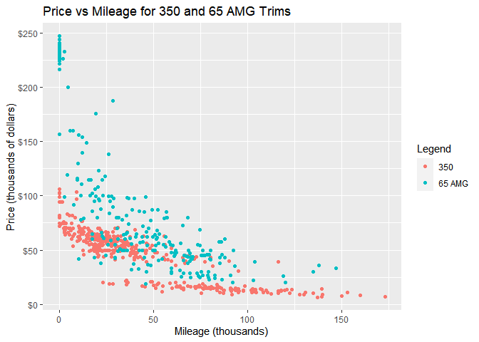

The 350 trim only has data on the years 1994, 1995, 2006, 2012, and
2013. Each year is concentrated in a particular section of the
scatterplot, so it is likely that an observation’s nearest neighbors
would be close to it in time as well. Because of the huge gap in time
between 1995 and 2006, there is a disjoint section for cars with mileage
around 25,000. This may influence the model because of the jump in data.

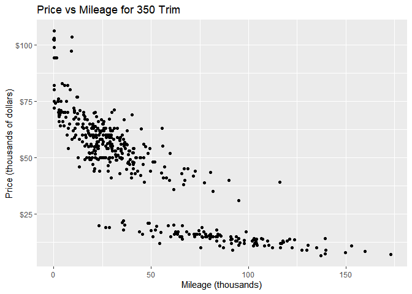

Faceting by years for the 350 trim reveals that certain years have
similar observations overall.

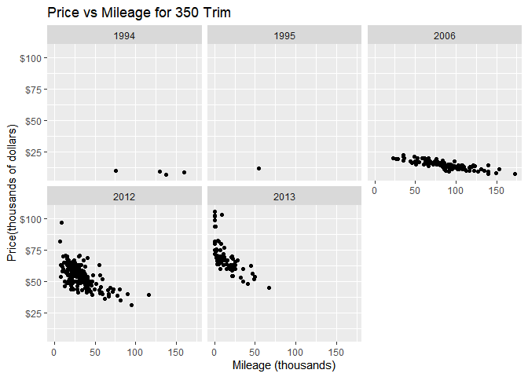

In contrast, the 65 AMG trim, with much fewer total observations, has a
smooth graph because the observations were gathered continuously for
more years (2006 through 2013, and 2015).

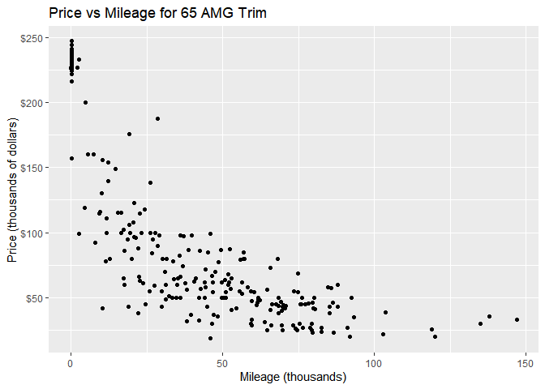

Faceting by year for the 65 AMG trim also reveals clusters of
observations for each year.

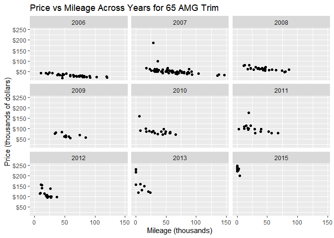

We start with the 350 trim model and find the optimal K that minimizes
the RMSE after iterating through many train-test splits. Then we compare
the KNN model to linear regression models, one of which predicts price
using mileage, and the other uses a polynomial of mileage predicting
price. The red line is the RMSE for the linear regression model and the
blue line is the second-degree polynomial.

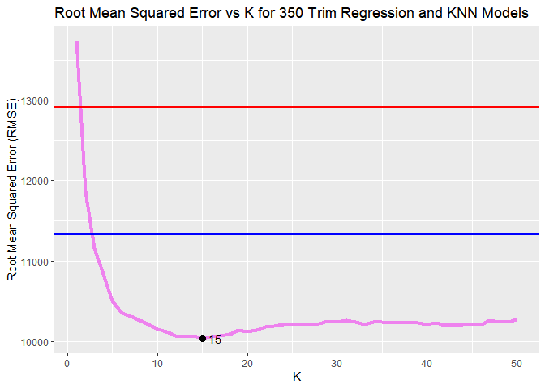

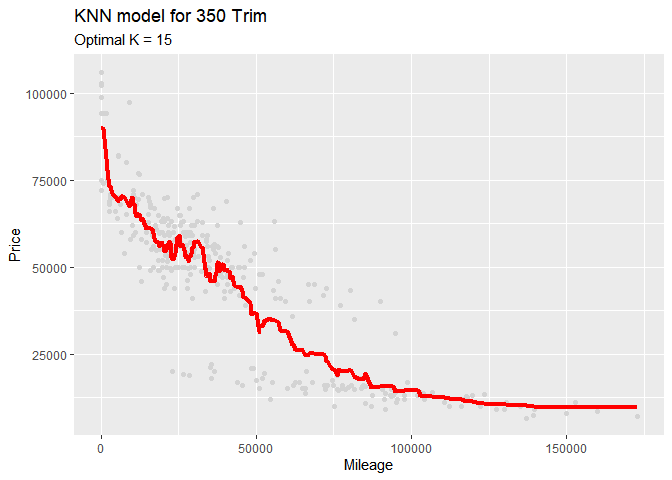

Repeat the procedure for the 65 AMG trim.
<!-- Train-test split for sclass 65 -->

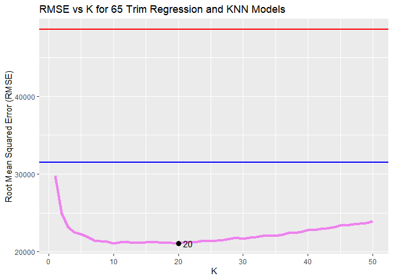

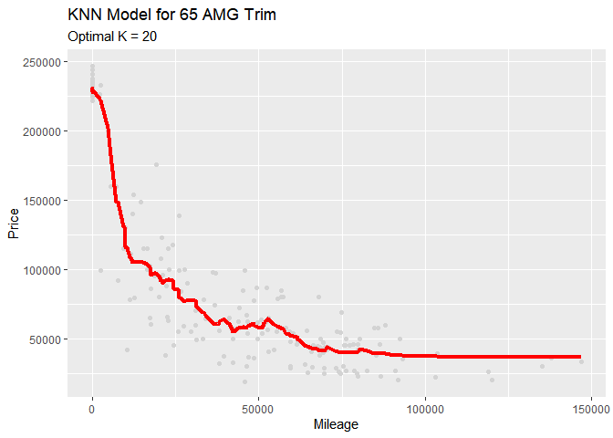

### Why do the optimal Ks differ for each trim?

Looking at a summary of price for the two different trims, it is
apparent that there is a tremendous difference in the price ranges for
the two car sub-models. The distribution of mileage for the two trims is
also different, with the 350 trim having a more normal distribution with
positive skew, and the 65 trim having many observations with very low or
zero values.

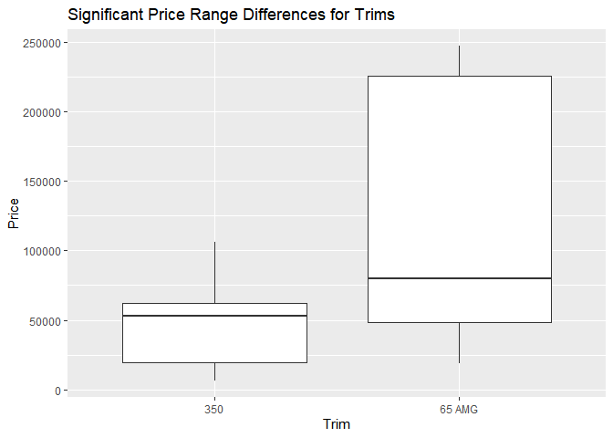

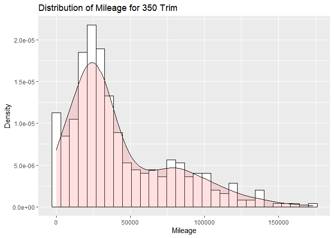

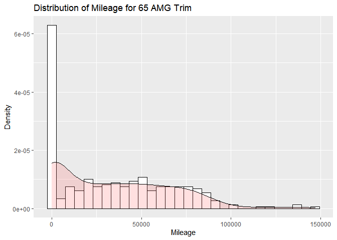

Conclusion
----------

For the 65 trim, the KNN model with the lowest RMSE seems to use K = 20
while the model for the 350 trim uses K = 15. It seems that the 65 AMG
trim has a much wider range, so the best KNN model generalizes over that
variation. In contrast, the 350 trim, although its mean is being pulled
downwards from low values, is more normally distributed and has a
tighter distribution. Also, there are fewer observations for the 65 AMG
trim, so it is more prone to outliers. Thus, due to the noise and fewer overall
points to average over, the model must be more flexible.

Visually, if we compare the price of each trim to mileage in the initial
graphs, the 65 AMG trim points are more spread out and have several
points with mileage values between 200,000 and 250,000 with low or zero
prices that could skew the results. Since the trend here is much less
obvious, the model benefits from a higher K; more points are being
averaged over and it results in a more “smoothed out” model. Conversely,
the 350 trim (although it appears to have 2 or 3 separate sub-groupings
with different slopes) has a more linear trend, so the model performs better
when K is smaller and the model is more granular.

If we compare the RMSEs for both, the out-of-sample RMSE for the 65 trim
model is almost twice that of the 350 model, so the model is worse for
the 65 AMG trim, likely due to the variation as described above. The
relatively higher K and RMSE values for the 65 AMG trim could suggest
high bias; the model is oversimplifying and struggling to make a
prediction. Another indication of this is that the liinear regression models
perform better for the 350 trim than for the 65 AMG trim; a
second-degree polynomial does not perform much better than a linear model
for the 350 trim, whereas the linear model has an extremely high error
rate compared to the polynomial and the KNN model for the 65 AMG.

In short, the 65 AMG trim is more difficult to predict than the 350 trim
due to less data being available, the more nonlinear pattern of price to
mileage, and the presence of leverage outliers.
