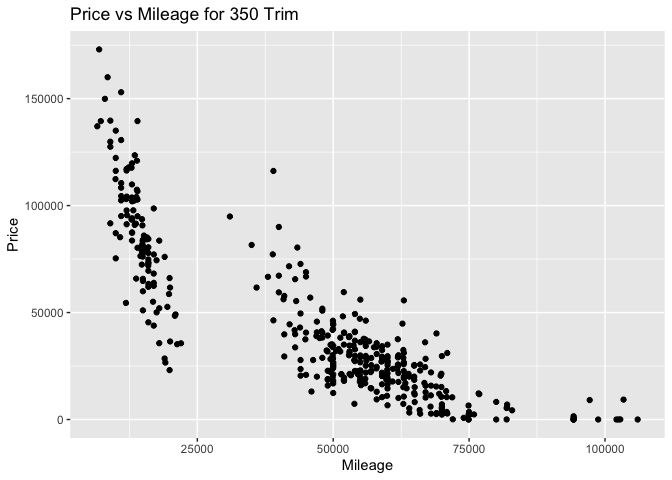
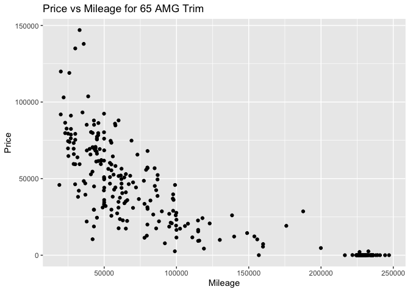
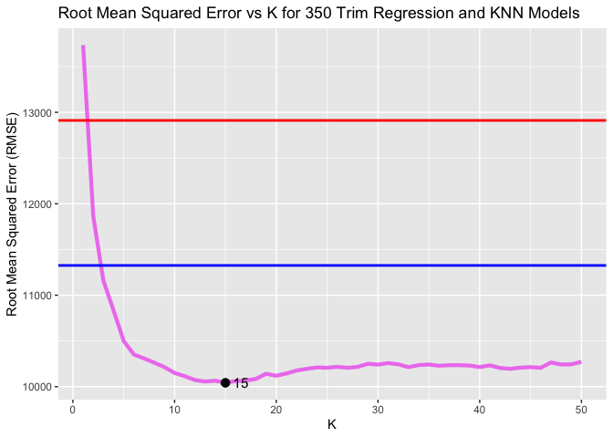
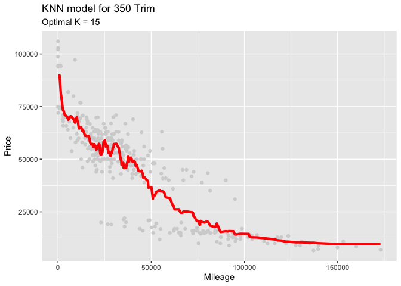
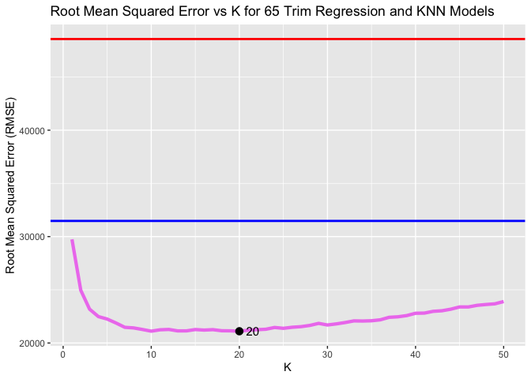
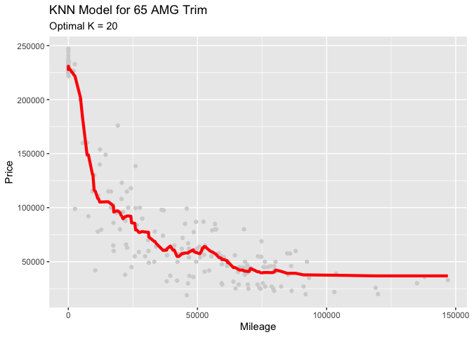
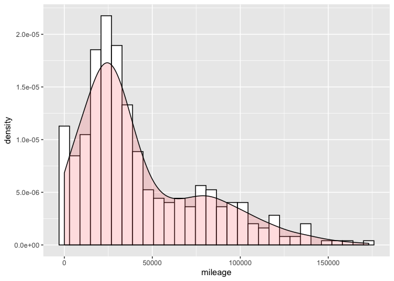
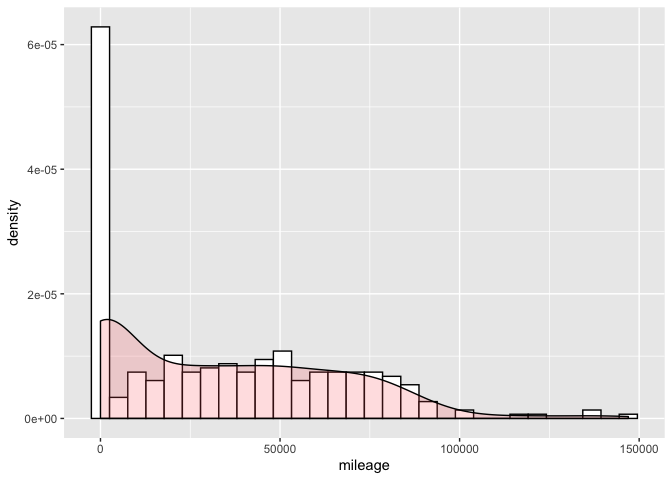

Problem 1: S Class
------------------

We start with the 350 trim model and find the optimal K that minimizes
the RMSE after iterating through many train-test splits. Then we compare
the KNN model to linear regression models, one of which predicts price
using mileage, and the other uses a polynomial of mileage predicting
price. The red line is the RMSE for the linear regression model and the
blue line is the second-degree polynomial.

Do the same for the 65 Trim Train-test split for sclass 65

<table>
<thead>
<tr>
<th style="text-align:left;">
</th>
<th style="text-align:right;">
min
</th>
<th style="text-align:right;">
Q1
</th>
<th style="text-align:right;">
median
</th>
<th style="text-align:right;">
Q3
</th>
<th style="text-align:right;">
max
</th>
<th style="text-align:right;">
mean
</th>
<th style="text-align:right;">
sd
</th>
<th style="text-align:right;">
n
</th>
<th style="text-align:right;">
missing
</th>
</tr>
</thead>
<tbody>
<tr>
<td style="text-align:left;">
</td>
<td style="text-align:right;">
18990
</td>
<td style="text-align:right;">
48711.25
</td>
<td style="text-align:right;">
79994.5
</td>
<td style="text-align:right;">
225975
</td>
<td style="text-align:right;">
247075
</td>
<td style="text-align:right;">
117121.1
</td>
<td style="text-align:right;">
81315.27
</td>
<td style="text-align:right;">
292
</td>
<td style="text-align:right;">
0
</td>
</tr>
</tbody>
</table>
<table>
<thead>
<tr>
<th style="text-align:left;">
</th>
<th style="text-align:right;">
min
</th>
<th style="text-align:right;">
Q1
</th>
<th style="text-align:right;">
median
</th>
<th style="text-align:right;">
Q3
</th>
<th style="text-align:right;">
max
</th>
<th style="text-align:right;">
mean
</th>
<th style="text-align:right;">
sd
</th>
<th style="text-align:right;">
n
</th>
<th style="text-align:right;">
missing
</th>
</tr>
</thead>
<tbody>
<tr>
<td style="text-align:left;">
</td>
<td style="text-align:right;">
6600
</td>
<td style="text-align:right;">
19401.25
</td>
<td style="text-align:right;">
52900
</td>
<td style="text-align:right;">
61991.25
</td>
<td style="text-align:right;">
106010
</td>
<td style="text-align:right;">
46854.32
</td>
<td style="text-align:right;">
22842.57
</td>
<td style="text-align:right;">
416
</td>
<td style="text-align:right;">
0
</td>
</tr>
</tbody>
</table>

Conclusion
----------

It seems that the 65 trim has a much wider range, so the best KNN model
generalizes over that variation. In contrast, the 350 trim, although its
mean is being pulled downwards from low values, is more normally
distributed and has a tighter distribution. Also, there are fewer
observations for the 65 trim, so it is more prone to outliers. Thus, due
to the noise and few points to average over, the model must be more
flexible. Visually, if we compare the price of each trim to mileage in
the initial graphs, the 65 trim points are more spread out and have
several points with mileage values between 200,000 and 250,000 with low
or zero prices that could skew the results. Since the trend here is much
less obvious, the model benefits from a higher K; more points are being
averaged over and it results in a more “smoothed out” model. Conversely,
the 350 trim (although it appears to have 2 or 3 separate sup-groupings
with different slopes) has a more linear trend, so the K performs better
when it is smaller and more granular.

If we compare the RMSEs for both, the out-of-sample RMSE for the 65 trim
model is almost twice that of the 350 model, so the model is worse for
the 65 trim, likely due to the variation as described above. The
relatively higher K and RMSE values for the 65 trim could suggest high
bias; the model is oversimplifying and struggling to make a prediction.
Another indication of this is that the regression models perform better
for the 350 trim than for the 65 trim; a second-degree polynomial does
not perform much better than a linear line for the 350 trim whereas the
linear model has an extremely high error rate compared to the polynomial
and the KNN model.
